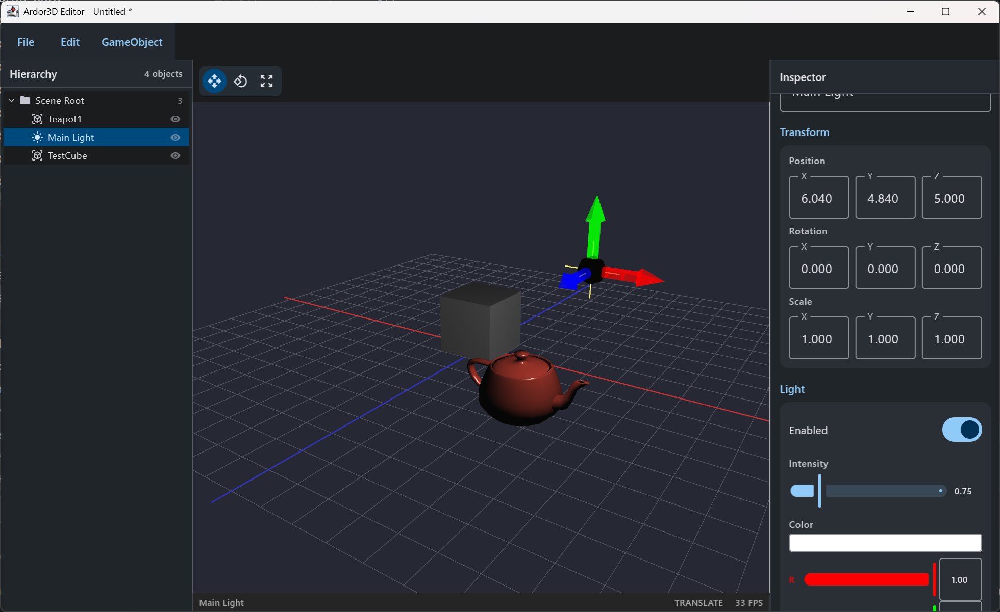

# ardor3d-editor

A visual scene editor for Ardor3D, built with Compose for Desktop. The 3D viewport is a real
`Lwjgl3AwtCanvas` embedded via `SwingPanel`, so everything you see is rendered by the engine
itself.



## Running

```
./gradlew :ardor3d-editor:run
```

Requires Java 17+. The module builds with its own Kotlin/Compose plugins and is skipped by the
root project's Java conventions.

Note: on WSLg (and Mesa drivers generally), lit meshes were historically invisible — that was
an engine bug (two shadow-sampler types sharing a texture unit; strict drivers reject the draw),
fixed in `LightManager`/`Lwjgl3ShaderUtils`. The editor now renders fully under WSLg.

## Features

- **Hierarchy panel** — live scene tree with selection, right-click context menu
  (Rename / Duplicate / Delete).
- **Multi-select** — ctrl-click toggles membership (hierarchy and viewport), shift-click selects
  a range in the hierarchy. Delete/Duplicate act on the whole selection as one undo step;
  selecting a node covers its descendants so they aren't processed twice.
- **Reparenting and reordering** — drag a hierarchy row onto the middle of a Node row to move
  it there (target highlights), or onto another row's top/bottom edge to insert before/after it
  (an insertion line shows where; dropping just below an expanded node inserts as its first
  child). Cycles and no-ops are rejected. World transforms are preserved across every move, and
  undo restores the original parent, position and local transform. Dragging an item that is
  part of a multi-selection onto a Node moves the whole selection; edge drops move just the
  dragged row. "Move to Root" is in the context menu.
- **Inspector panel** — name, transform (position / XYZ Euler rotation / scale), mesh info,
  ColorSurface material (diffuse/ambient/specular/emissive, shininess), wireframe toggle, and
  light properties (enabled / intensity / color). With a multi-selection, transform edits apply
  the edited component to every selected object (each keeps its other components), material
  edits to every selected mesh, and light edits to every selected light - each gesture is one
  merged undo step. Transform fields show a dash where the selection disagrees.
- **Viewport** — WASD + drag fly camera, mouse-wheel dolly, primitive-accurate click selection,
  v2 transform gizmos for translate/rotate/scale (eased hover highlight, per-gizmo cursors,
  Ctrl-snap, Escape to cancel a drag), per-light overlay gizmos, reference grid.
- **Undo/redo everywhere** — every mutation goes through a command stack
  (`com.ardor3d.editor.command`). Continuous gestures (slider drags, typing, gizmo drags)
  coalesce into single undo steps. `Ctrl+Z` / `Ctrl+Shift+Z` / `Ctrl+Y`.
- **Persistence** — File > New / Open / Save / Save As using Ardor3D's binary format (`.a3d`),
  plus Wavefront OBJ and COLLADA (`.dae`) import. Unsaved changes are flagged in the title bar
  and confirmed before being discarded.
- **Object creation** — GameObject menu: 13 primitive shapes, empty nodes, and
  point/directional/spot lights. New objects are created under the selected Node (or the scene
  root).
- **Visibility** — per-row eye toggle in the hierarchy hides/shows a subtree (undoable). Hidden
  objects are culled and unpickable, so viewport clicks pass through them, and every light in the
  hidden subtree is disabled so it stops illuminating the scene (restored on show/undo).

### Keyboard shortcuts

| Key | Action |
| --- | --- |
| `1` / `2` / `3` | Translate / Rotate / Scale mode (viewport focused) |
| `R` | Toggle world / local gizmo frame (viewport focused) |
| `Ctrl` / `Cmd` (hold while dragging a gizmo) | Snap: translate to 1 unit, rotate to 15°, scale to ¼ |
| `F` | Frame selection (viewport focused) |
| `Delete` | Delete selection (viewport focused) |
| `Escape` | Clear selection (viewport focused) |
| `W A S D` + right-drag | Fly camera (viewport focused) |
| `Ctrl+Z` / `Ctrl+Shift+Z` / `Ctrl+Y` | Undo / Redo (window-wide) |
| `Ctrl+D` | Duplicate selection (window-wide) |
| `Ctrl+N` / `Ctrl+O` / `Ctrl+S` / `Ctrl+Shift+S` | New / Open / Save / Save As (window-wide) |

## Architecture notes

- **Windowing / viewport integration** — the UI is Compose Desktop (Skia) hosted in a Swing
  window; the 3D viewport is the engine's `Lwjgl3AwtCanvas` (lwjgl3-awt), a *heavyweight* AWT
  canvas with a native GL context, embedded via `SwingPanel`. This gives the engine renderer a
  real on-screen surface with zero per-frame copies, and reuses the same `ardor3d-lwjgl3-awt`
  path any Swing-embedding application uses. The trade-off is classic heavyweight airspace:
  the canvas paints above in-window Skia content, so Compose chrome belongs *beside* the
  viewport, never layered over it — anything that must draw inside the viewport (grid, gizmos,
  readouts) is engine-rendered on the editor overlay root instead. Compose popups and dialogs
  are separate OS windows and are unaffected. If this constraint ever becomes limiting, the
  seam is contained: swapping the `SwingPanel` for an offscreen-FBO-to-Skia-image bridge would
  touch only the viewport composable and canvas setup.
- **Document vs. overlay** — `EditorScene` renders two roots: the *document*
  (`EditorState.sceneRoot`, what the user edits and saves) and an *editor overlay* (grid, light
  gizmos) that never appears in the hierarchy, picking, or saved files.
- **Threading** — the Swing timer drives `FrameHandler.updateFrame()` on the AWT EDT, and
  Compose Desktop dispatches UI events on the EDT too, so scene mutations never race the render
  loop. Document lifecycle actions (open/save/new/import) are queued and executed at the top of
  `update()` so they run with the GL context current.
- **Change notification** — panels observe coarse version counters on `EditorState`
  (`transformVersion`, `structureVersion`, `propertyVersion`, `historyVersion`) that bump only
  when something actually changed; there is no per-frame recomposition.
- **Commands** — `EditorCommand` / `CommandStack` in `com.ardor3d.editor.command`. UI code
  builds `SetterCommand`s with merge keys for coalescing; gizmo drags are captured by
  `GizmoUndoFilter`, an interact-system `UpdateFilter` that records one command per drag.
- **Serialization** — scenes save with `BinaryExporter`. Render materials are not serialized;
  they are re-derived on load with `MaterialUtil.autoMaterials`. `ColorSurface` properties,
  render states, lights and transforms round-trip (covered by `SceneRoundTripTest`).

## Known limitations / next steps

- With a multi-selection the inspector's name field still edits the primary (first) object
  only, and the material/light sections display the primary's values (no mixed-value dash
  there, unlike the transform fields).
- Window-wide shortcuts (Ctrl+Z/D/N/O/S) fire even while a text field has focus — same seam as
  the pre-existing undo/redo binding; Compose offers no clean focus check at the Window level.
- Rotation is edited as XYZ Euler angles. The inspector keeps the angles you type (even at the
  attitude ±90° singularity, where the decomposition isn't unique) and only re-derives them from
  the matrix after a gizmo drag or undo — after one of those, an equivalent-but-different
  triplet may be shown.
- No camera objects or play mode.
- Model import covers OBJ and COLLADA (static geometry; COLLADA animations are not brought into
  the editor). Other formats in `ardor3d-extras` could be added to
  `com.ardor3d.editor.io.ModelImport` the same way.
